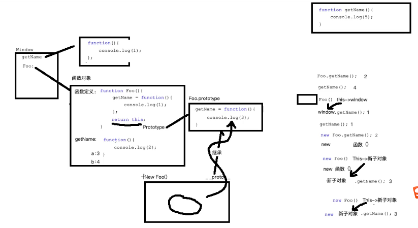

## 第1题 作用域
```js
// 
// (1) 变量提升 var num1， num2， function f1(){}
var num1 = 55
var num2 = 66
function f1(num, num1){
  // 有参数先声明形参的临时作用域 var num， num1 形参赋值 num=55， num1=66
  num = 100 // 修改num
  num1 = 100 // 修改num1
  num2 = 100 // 查找当前作用域 没有上一层作用域查找 找到全局 num2并修改为100
  console.log(num) // 100
  console.log(num1) // 100
  console.log(num2) // 100
}
f1(num1, num2)
console.log(num2) // 100 全局num2在函数内部被修改为100
console.log(num1) // 55 全局num1
console.log(num) // 全局未找到num声明则报错 num is not defiend
```

## 第2题 值类型和引用类型的传递
```js
function Person(name, age){
  this.name =  name
  this.age = age
}
function f1(person){
  // 形参临时作用域  var person 形参声明 person = p (0x111) 赋值
  person.name = 'ls' // 将 0x1111 地址中的name修改为 { name: 'ls', age: 16 }
  person = new Person('ww', 18) // 重新开辟空间 Ox2222 {name: 'ww', age: 18} 局部变量person指向新地址Ox2222
}
var p = new Person('zs', 16) // 创建对象地址 Ox1111
console.log(p.name) // zs
f1(p)
console.log(p.name) // ls 输出 Ox1111 地址中的 name: ls
```

## 第3题 字符串转驼峰命名
```js
// 将 'get-element-by-id' 转化为 'getElementById'
function toHump(str){
  var arr = str.split('-')
  for(var i=1;i<arr.length;i++){
    arr[i] = arr[i].charAt(0).toUpperCase() + arr[i].substring(1)
  }
  return arr.join('')
}
toHump('get-element-by-id') // getElementById
```

## 第4题 冒泡排序
```js
var arr = [2, 1, 5, 3, 4]
var len = arr.length-1
// 轮数
for(var i=0;i<len;i++){
  // 次数
  for(var j=0;j<len-i;j++){
    // 交换位置
    if(arr[j]>arr[j+1]){
      var temp = arr[j]
      arr[j] = arr[j+1]
      arr[j+1] = temp
    }
  }
}
console.log(arr)
```

## 第5题 不使用reverse反转数组
```js
// 交换位置 反转数组
var arr = [1,2,3,4,5]
for(var i=0;i<arr.length/2;i++) {
  // arr[0] 和 arr[arr.length-1-0] 交换
  // arr[1] 和 arr[arr.length-1-1] 交换
  // arr[2] 和 arr[arr.length-1-2] 交换
  // 利用第三方变量交换两个变量的值
  var temp = arr[i]
  arr[i] = arr[arr.length-1-i]
  arr[arr.length-1-i] = temp
}
console.log(arr)
```

## 第6题 js综合面试题getName
```js
/* 变量提升 函数提升
1 function Foo(){
    getName = function(){ console.log(1) }
    return this
  }
// 2 var getName 被同名函数 getName() 覆盖
// 3 function getName(){ console.log(5) }

// 执行代码阶段
Foo.getName = function(){ console.log(2) }
Foo.prototype.getName = function(){ console.log(3) }
getName = function(){ console.log(4) }
4 getName = function(){ console.log(4) }

最终执行到这里时
function Foo(){
  getName = function(){ console.log(1) }
  return this
}
Foo.getName = function(){ console.log(2) }
Foo.prototype.getName = function(){ console.log(3) }
getName = function(){ console.log(4) }

*/
function Foo(){
  getName = function(){ console.log(1) }
  return this
}
Foo.getName = function(){ console.log(2) }  // 类的静态方法
Foo.prototype.getName = function(){ console.log(3) }
var getName = function(){ console.log(4) }
function getName(){ console.log(5) }

Foo.getName() // 2  执行 function(){ console.log(2) }
getName() // 4 执行 function(){ console.log(4) }()
// Foo() 将全局getName修改为 getName = function(){ console.log(1) } 并返回this --> window
Foo().getName() // 1  (Foo()).getName()--> window.getName()
getName() // 1 执行 getName = function(){ console.log(1) }
// . 操作符优先级高 new (Foo.getName)() --> new (function(){ console.log(2) })()
new Foo.getName() // 2  
// foo.getName === Foo.prototype.getName 实例对象的隐式原型就等于构造函数的显示原型
// (new Foo()).getName()--> foo.getName() === Foo.prototype.getName()
new Foo().getName() // 3 
// new ((new Foo()).getName)()--> new (foo.getName)()--> new (function(){ console.log(3) })()
new new Foo().getName() // 3 
```


## 第7题 什么是函数节流？ 什么是函数防抖
* 函数节流：一个函数执行一次后，只有大于设定的执行周期后才会执行第二次
需要频繁触发的函数，在规定时间内，只让函数触发的第一次生效，后面不生效
```js
/**
* 节流函数
* @param fn 要被节流的函数
* @param delay 规定的时间
*/
function throttle(fn, delay){
  var lastTime = 0 // 记录上一次函数触发的时间
  return function(){
    var nowTime = Date.now() // 记录当前函数触发的时间
    if (nowTime - lastTime > delay) {
      fn.call(this) // 修改this指向
    }
    lastTime = nowTime // 同步时间
  }
}

document.onscroll = throttle(function(){
  console.log('scroll')
}, 60)
```
* 防抖函数：一个需要频繁触发的函数，在规定时间内，只让函数触发的最后一次生效，前面的不生效
```js
/**
* 防抖函数
* @param fn 要被防抖的函数
* @param delay 规定的时间
*/
function debounce(fn, delay){
  var timer = null
  return function () {
    clearTimeout(timer) // 清除上一次延时器
    // 重新设置新的延时器
    timer = setTimeout(function () {
      fn.call(this)
    }, delay)
  }
}
input.oninput = debounce(function(){
  console.log(input.value)
}, 200)
```

## 第8题 闭包
