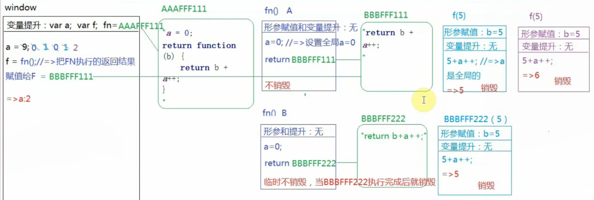
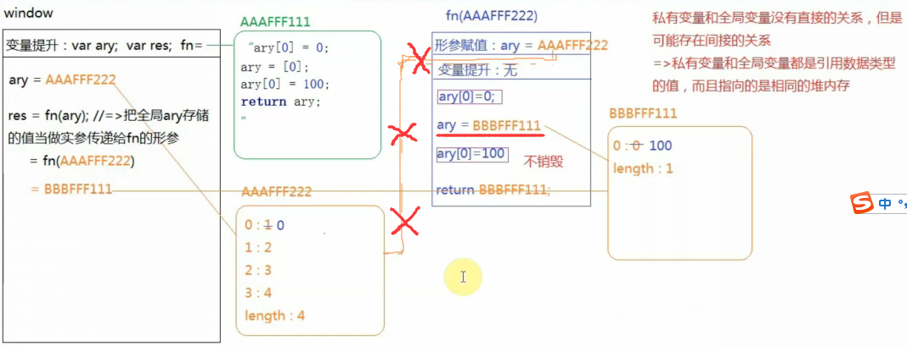
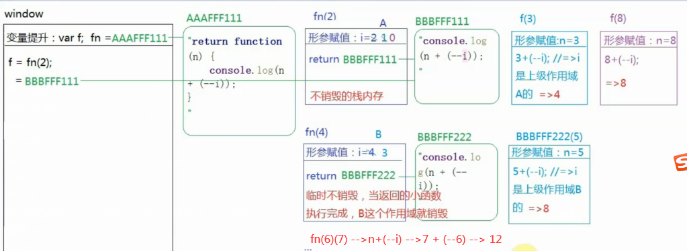
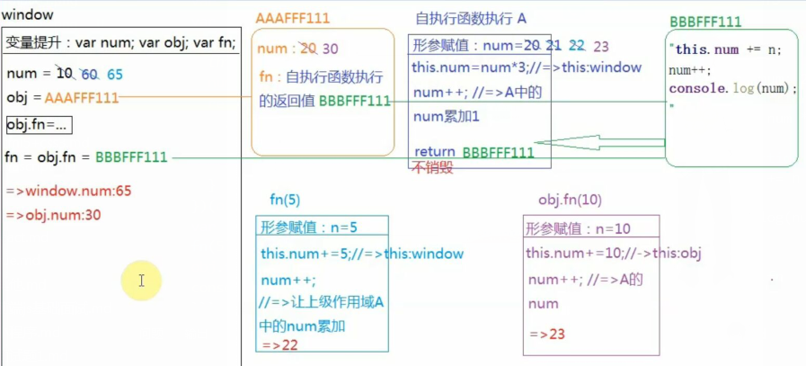
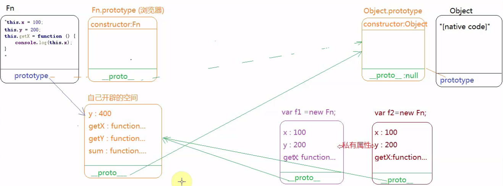

## 1. queryURLParameter处理地址栏参数
```js
let url = 'https://www.baidu.com/s?wd=javascript&rsv_spt=1'
function queryURLParameter(url){
  // 匹配等号左边 非 ？ & = 的字符
  let reg = /([^?&=]+)=([^?&=]+)/g, obj = {}
  url.replace(reg, function(){
    console.log(arguments)
    obj[arguments[1]] = arguments[2]
  })
  return obj
}
console.log(queryURLParameter(url)) // {wd: "javascript", rsv_spt: "1"}

var search = "?uname=tew&pwd=123&favs=swimming&favs=running"
function search2obj(str){
  var obj = {}
  str = str.slice(1) // 去掉str开头的?
  // 按&切割 str
  var arr = str.split('&')
  // ['uname=tew', 'pwd=123', 'favs=swimming', 'favs=running']
  for (var s of arr) {
    var [key, value] = s.split('=')
    // 如果obj中不包含key为下标的属性就添加 key及value
    if (obj[key] === undefined) {
      obj[key] = value
    } else {
    // 如果obj已包含key 就取出key和新值value拼成新数组 再放回obj中key属性保存
      obj[key] = [].concat(obj[key], value)
    }
  }
  return obj
}
var obj = search2obj(search)
console.log(obj) // {uname: "tew", pwd: "123", favs: ["swimming", "running"]}
```

## 2. 作用域链
```js
//=> 全局下变量提升 var n var c a = AAAFFFF1111
var n = 0;
function a(){
  //=> 私有作用域 var n  b = BBBFFF111
  var n = 10 //=> n=11 n=12
  function b(){
    //=> 私有作用域
    n++ //=> 上级作用域
    console.log(n) // 11 12
  }
  b()
  return b //=> return BBBFFF111
}
var c = a() // BBBFFF111 被外面变量引用 不会回收
c() // BBBFFF111
console.log(n) // 0
// 11  12  0
```

## 3. 形参与私有作用域
```js
//=> 全局下变量提升 var x var y var z test=OOOXXX=function(){...}
var x = 10, y = 11, z = 12 // 赋值
function test(a){
  //=>函数执行形成私有作用域： 1. 形参赋值  2. 变量提升
  //=>私有 a=10 var b
  a = 1 // 将私有作用域下 a=1
  var b = 2 // 将私有作用域下 b=2
  c = 3 //=> 全局 c=3
}
test(10)
console.log(a) // 10
console.log(b) // 11
console.log(c) // 3
```

## 4. 全局与if判断
```js
// => 变量提升 var foo function bar(){...} 
var foo = 1 // 赋值 foo = 1
function bar(){ // 私有作用域内
  // 不管if是否成立 都会发生变量提升 var foo值为undefined => !foo为true 执行私有作用域foo = 10 打印私有作用域 foo输出10
  if(!foo){
    var foo = 10
  }
  console.log(foo)
}
bar() // 10
```

## 5. arguments对象
```js
/** 
在JS非严格模式下
  函数实参集合arguments与形参变量存在 映射 关系不管谁改变另外一个也会发生改变
在JS严格模式下
  函数实参集合arguments与形参变量 映射关系被切断 相互之间互不干扰
*/
// 变量提升 var a b = AAFF11
var a = 4 // 全局a赋值为4 a=4
function b(x, y, a){
  // -> 私有作用域 行x=1 y=2 a=3
  console.log(a) // 3 私有作用域
  arguments[2] = 10 // 让第三个传递进来的实参a = 10
  console.log(a) // 10 非严格模式下 arguments与形参存在映射关系
}
a = b(1, 2, 3)
console.log(a) // undefiend
// 严格模式与非严格模式不一样的地方
/*
严格模式下 argments.caller argments.callee 不能使用
严格模式下 argments与形参断掉映射关系 非严格模式下 argments与形参存在映射关系
严格模式下 没有明确指定函数的执行者this指向undefined 非严格模式下 this指向window
*/
```

## 6. 形参与短路运算符
```js
var foo = 'hello';
(function(foo){
  // => 私有作用域  形参赋值 foo = 'hello'(foo和外面的foo是不同的变量)
  // 因私有作用域已存在 foo = 'hello' 不会在发生变量提升重新声明 var foo被忽略
  console.log(foo) // hello
  var foo = foo || 'world'
  console.log(foo) // hello
})(foo) // 把全局foo的值当做实参传递给私有作用域中的形参
console.log(foo) // hello
```

## 7. 闭包练习题1
```js
var a = 9
function fn(){
  a = 0;
  return function (b){
    return  b+a++
  }
}
var f = fn()
console.log(f(5))
console.log(fn()(5))
console.log(f(5))
console.log(a)
```


## 8. 数组与形参
```js
var ary = [1, 2, 3, 4]
function fn(ary){
  ary[0] = 0
  ary = [0]
  ary[0] = 100
  return ary
}
var res = fn(ary)
console.log(ary)
console.log(res)
```


## 9. 闭包练习题2
```js
function fn(i) {
  return function (n) {
    console.log(n + (--i))
  }
}
var f = fn(2)
f(3)
fn(4)(5)
fn(6)(7)
f(8)
```



## 10. 闭包与this
```js
var num = 10
var obj = { num: 20 }
obj.fn = (function(num){
  this.num = num * 3
  num++
  return function (n) {
    this.num += n
    num++
    console.log(num)
  }
})(obj.num)
var fn = obj.fn
fn(5)
obj.fn(10)
console.log(num, obj.num)
```


## 11. 原型链练习1
```js
function Fn() {
  this.x = 100
  this.y = 200
  this.getX = function () {
    console.log(this.x)
  }
}
Fn.prototype = {
  y: 400,
  getX: function () {
    console.log(this.x)
  },
  getY: function () {
    console.log(this.y)
  },
  sum: function () {
    console.log(this.x + this.y)
  }
}
var f1 = new Fn()
var f2 = new Fn()
console.log(f1.getX === f2.getX) // false
console.log(f1.getY === f2.getY) // true
console.log(f1.__proto__.getY === Fn.prototype.getY) // true
console.log(f1.__proto__.getX === f2.getX) // false
console.log(f1.getX === Fn.prototype.getX) // false
console.log(f1.constructor) // Object(){[native code]}
console.log(Fn.prototype.__proto__.constructor) // Object(){[native code]}
f1.getX() // f1.x ==> 100
f1.__proto__.getX() //  f1.__proto__.getX() === Fn.prototype.getX() ==> undefined
f2.getY() // 200  this-> f2  f2.getY() ===> Fn.prototype.getY()
Fn.prototype.getY() // 400
f1.sum() //  f1.sum() === Fn.prototype.sum() ==> 300
Fn.prototype.sum() // Fn.prototype.x + Fn.prototype.y ==> undefined + 400 ==> NaN
```


## 12. this面试题1
```js
var fullName = 'language'
var obj = {
  fullName: 'javascript',
  prop: {
    getFullName: function (){
      return this.fullName
    }
  }
}
// this --> obj.prop --> obj.prop.fullName --> undefined
console.log(obj.prop.getFullName()) // undefined
var test = obj.prop.getFullName
// this --> window --> window.fullName --> language
console.log(test()) // language
```

## 13. this面试题2
```js
var name = 'window'
var Tom = {
  name: 'Tom',
  show: function () {
    console.log(this.name)
  },
  wait: function () {
    var fn = this.show
    fn()
  }
}
// this--> Tom ==> this.name === Tom.name ==> Tom 
Tom.show() // Tom
// fn ==> Tom.show ==> fn() this-->window ==> window.name ==> window
Tom.wait() // window
```

## 14. 原型链练习2
```js
function fun(){
  this.a = 0
  this.b = function(){
    console.log(this.a)
  }
}
fun.prototype = {
  b: function () {
    this.a = 20
    console.log(this.a)
  },
  c: function () {
    this.a = 30
    console.log(this.a)
  }
}
var fn = new fun() // fn ==> { this.a = 0; this.b = function(){ console.log(this.a) }}
fn.b() // 0  私有方法 b
// fn.__proto__ === fun.prototype
// fn.c === fun.prototype.c ==> this.a = 30 ==> console.log(this.a) ==> 30
fn.c() // 30 共有方法 c 将私有属性a修改为30
var fn1 = new fun()
console.log(fn1.a) // 0
fn1.__proto__.c() // this--> fn1.__proto__  ===> fn1.__proto__.a = 30(在类fun的公有属性上增加一个a属性值为30)
console.log(fn1.a) // 0 私有属性还是 0
console.log(fn.__proto__.a) // 30 类fun的公有属性a
```
