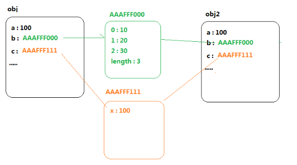
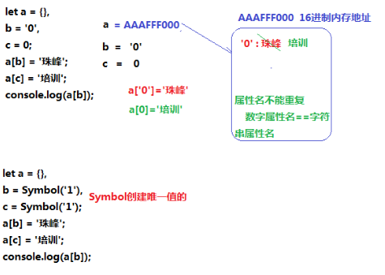
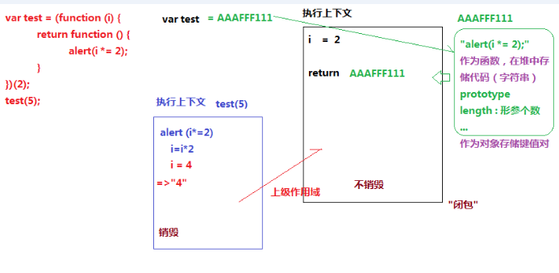
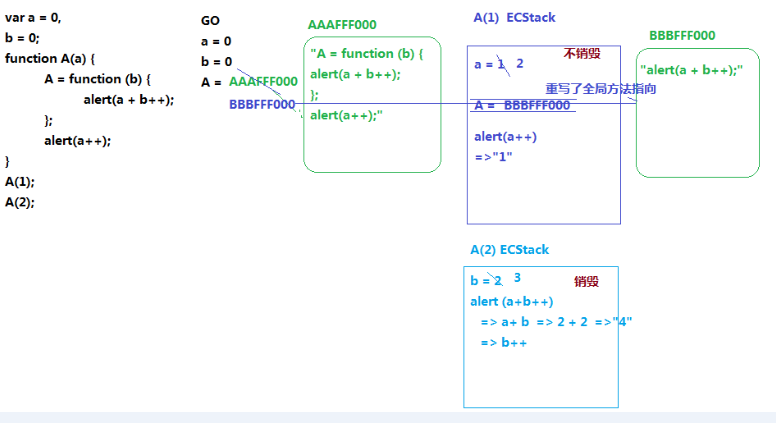
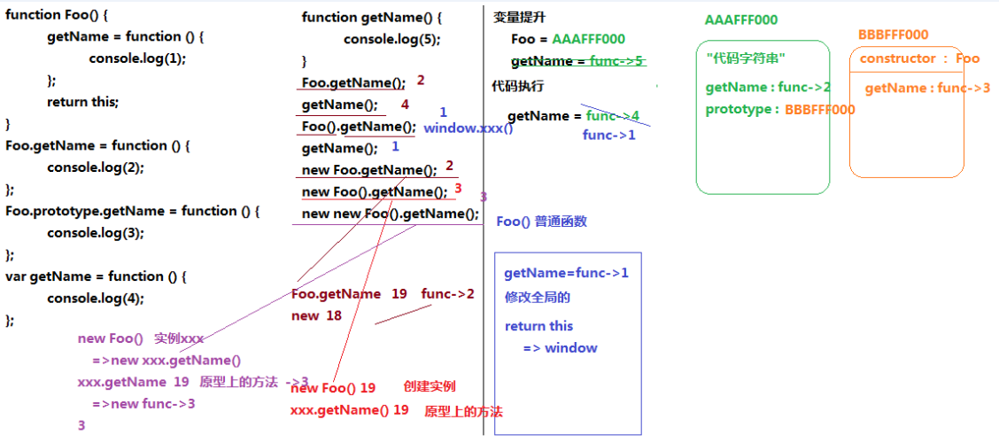
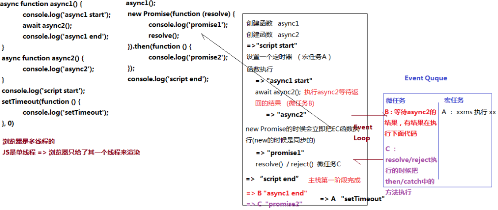

## 一线大厂前端面试题4天训练营(2)
1. 对象(数组)的深克隆和浅克隆（头条）
```js
let obj = {
    a: 100,
    b: [10, 20, 30],
    c: {
        x: 10
    },
    d: /^\d+$/
};

let arr = [10, [100, 200], {
    x: 10,
    y: 20
}];

//=>深克隆
function deepClone(obj) {
    //=>过滤特殊情况
    if (typeof obj !== "object") return obj;
    if (obj instanceof RegExp) return new RegExp(obj);
    if (obj instanceof Date) return new Date(obj);
    //=>不直接创建空对象目的：克隆的结果和之前保持相同的所属类
    let cloneObj = new obj.constructor;
    for (let key in obj) {
        if (obj.hasOwnProperty(key)) {
            cloneObj[key] = deepClone(obj[key]);
        }
    }
    return cloneObj;
}
```


2. BAT笔试题中几道关于堆栈内存和闭包作用域的题
```js
//example 1
let a={}, b='0', c=0;  
a[b]='珠峰';
a[c]='培训';  
console.log(a[b]); // 培训
​// 堆： 存储引用类型值的空间
// 栈： 存储基本类型值和执行代码的环境
// 属性名不能重复 数字属性名 == 字符串属性名
---------------------
//example 2
let a={}, b=Symbol('1'), c=Symbol('1');  
a[b]='珠峰';
a[c]='培训';  
console.log(a[b]); // 珠峰
​// {Symbol(1): "珠峰", Symbol(1): "培训"}
---------------------
//example 3
let a={}, b={n:'1'}, c={m:'2'};  
a[b]='珠峰';
a[c]='培训';  
console.log(a[b]); // 培训
// {[object Object]: "培训"} 
// a[b] === a[b.toString()] === a[object Object]
// a[c] === a[b.toString()] === a[object Object]
```


```js
var test = (function(i){
    return function(){
        alert(i*=2)
    }
})(2)
test(5) // '4'
// alert()  弹出来的值都是字符串 
// var a = { b:1 }  alert(a) --> alert(a.toString())--> [object Object]
```



```js
var a=0,
    b=0;
function A(a){
    A=function(b){
        alert(a+b++);
    };
    alert(a++);
}
A(1);
A(2);
// A = function(b){ alert(a+b++) }
// alert(a++) --> alert(a) // '1' 
// A(2) --> function(2){ alert(2+2++) }  // '4'
```

3. 一道关于面向对象面试题所引发的血案（阿里）
[面向对象](https://developer.mozilla.org/zh-CN/docs/Web/JavaScript/Reference/Operators/Operator_Precedence)
```js
// 变量提升 就是在  var 和 function fn() 时，在当前作用域下，当前执行上下文下，所有代码执行之前  把所有 var 和 function fn() 提前声明和定义
function Foo() {
    getName = function () {
        console.log(1);
    };
    return this;
}
Foo.getName = function () {
    console.log(2);
};
Foo.prototype.getName = function () {
    console.log(3);
};
var getName = function () {
    console.log(4);
};
function getName() {
    console.log(5);
}
Foo.getName();
getName();
Foo().getName();
getName();
new Foo.getName();
new Foo().getName();
new new Foo().getName();
```



4. 一道面试题让你彻底掌握JS中的EventLoop（头条）
```js
// 先执行同步代码 async同步 在考虑异步队列  在异步队列中  先执微任务  在执行宏任务
// 宏任务(定时器 事件绑定 ajax)
// promise await 微任务
async function async1() {
    console.log('async1 start');
    await async2();
    console.log('async1 end');
}
async function async2() {
    console.log('async2');
}
console.log('script start');
setTimeout(function() {
    console.log('setTimeout');
}, 0)
async1();
new Promise(function(resolve) {
    console.log('promise1');
    resolve();
}).then(function() {
    console.log('promise2');
});
console.log('script end');
```



## 课后作业
* 第一题：写出下面代码输出的结果
```js
function A(){
    alert(1);
}
function Func() {
    A=function(){
       alert(2);
    };
    return this;
}
Func.A=A;
Func.prototype={
    A:()=>{
       alert(3);
    }
};
A();
Fn.A();
Fn().A();
new Fn.A();
new Fn().A();
new new Fn().A();  // 报错  箭头函数不能被new
```

* 第二题：写出下面代码输出的结果
```js
var x=2;
var y={
    x:3,
    z:(function(x){
        this.x*=x;
        x+=2;
        return function(n){
            this.x*=n;
            x+=3;
            console.log(x);
        }
    })(x)
};
var m=y.z;
m(4);
y.z(5);
console.log(x, y.x);
```

* 第三题：写出下面代码输出的结果
```js
/*
==  数据类型不一致是
1. 对象 == 字符串 -->  对象.toString() 变为字符串
2. null == undefiend --> null和undefined相等 但和其他值比较就不相等
3. NaN == NaN -->  NaN和任何值都不相等包括自己
4. 剩下的都转换为数字
对象转换为数字  Number(对象.toString())  Number([10].toString())-->10
*/
var a = ?;  // a = true
if (a == 1 && a == 2 && a == 3) {
    console.log(1);
}
/* 
// 方法一  a 为对象 重写a对象原型toString方法  == 比较会先调用  对象.toString() 然后在Number
var a = {
    i: 0,
    toString() {
        return ++this.i;
    }
};
if (a == 1 && a == 2 && a == 3) {
    console.log('条件成立');
}

// 方法二 类似方法一 都是在对象和数字比较的时候，依托默认会把对象转换为字符串，在转换为数字的原则，调取toString方法的时候做一些处理  => 改为a.join=a.shift 也是可以的
var a = [1, 2, 3];
a.toString = a.shift;
if (a == 1 && a == 2 && a == 3) {
    console.log('条件成立');
}

// 方法三 数据劫持实现  Object.defineProperty
利用Object.defineProperty，在获取全局属性a的值的时候，触发GETTER函数，从而返回指定的值（Vue2.0双向数据绑定的原理）
var i = 0;
Object.defineProperty(window, 'a', {
    get() {
        return ++i;
    }
});
if (a == 1 && a == 2 && a == 3) {
    console.log('条件成立');
} 

// 方法四 数据劫持实现  proxy
*/ 
```

* 第四题：写出下面代码输出的结果
```js
var x=0,
    y=1;
function fn(){
    x+=2;
    fn=function(y){
        console.log(y + (--x));
    };
    console.log(x, y);
}
fn(3);
fn(4);
console.log(x, y);
```

* 第五题：写出下面代码输出的结果
```js
setTimeout(() => {
    console.log(1);
}, 20);
console.log(2);
setTimeout(() => {
    console.log(3);
}, 10);
console.log(4);
console.time('AA');
for (let i = 0; i < 90000000; i++) {
    // do soming
}
console.timeEnd('AA'); //=>AA: 79ms 左右
console.log(5);
setTimeout(() => {
    console.log(6);
}, 8);
console.log(7);
setTimeout(() => {
    console.log(8);
}, 15);
console.log(9);
```

3. 实例对象, 构造函数, Objact, Function的关系
```js
  var F = function(){}
  Object.prototype.a = function(){
    console.log('a()')
  }
  Function.prototype.b = function(){
    console.log('b()')
  }
  var f = new F()

  F.a() // ?
  F.b() // ?
  f.a() // ?
  f.b() // ?
```